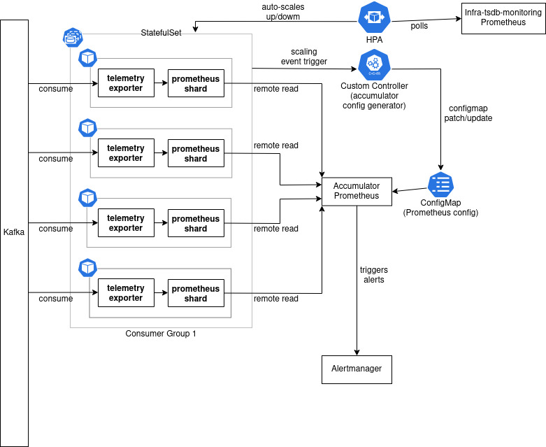

# prometheus-remote-read-updater
custom controller to update the remote-read configs for a prometheus instance based on the scaling events of the prometheus shards
# Introduction

## Autoscaling - Metrics exporter and Prometheus shard
### Challenges:
1. To autoscale the shard pod(prometheus+exporter) based on some metrics scraped by infra-tsdb-monitoring(prometheus)
2. During Scale up or down events, the [remote-read config](https://prometheus.io/docs/prometheus/latest/configuration/configuration/#remote_read) also needs to be updated in the accumulator prometheus to function seamlessly with these events.

### Solution proposed:
* __Problem 1__ : Use [HPA](https://kubernetes.io/docs/tasks/run-application/horizontal-pod-autoscale/) to poll the infra-tsdb-monitoring prometheus for certain metrics, and based on the value of the query we autoscale the pods in the statefulset
* __Problem 2__ : Use a custom custroller that listens to the creation/termination of pods with certain labels/annotaions. Based on the type of event, the controller would :
  1. Extract the prometheus.yml stored in a specific configmap (used to store accumulator prometheus config)
  2. Add/remove remote-read url specific to the pod created/terminated
  3. _(Optional)_ Run `promtool check config prometheus.yml` to validate the resulting configuration
  4. Perform update/patch on the concerned configmap.

### Components to be used:
1. [HPA](https://kubernetes.io/docs/tasks/run-application/horizontal-pod-autoscale/)
2. Kubernetes custom controller (accumulator-config-generator)
